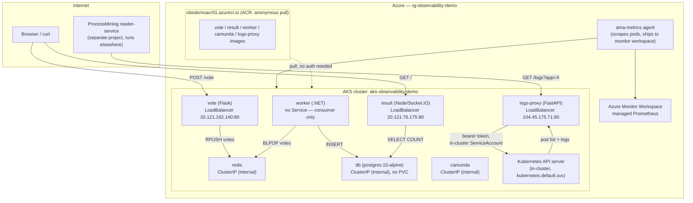
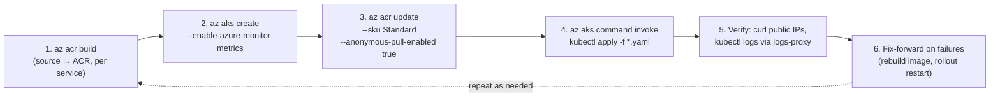
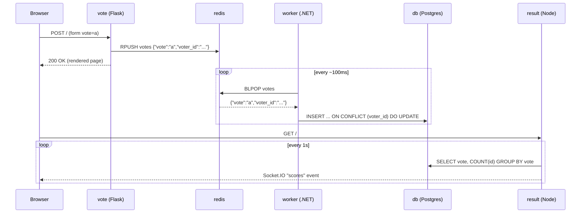
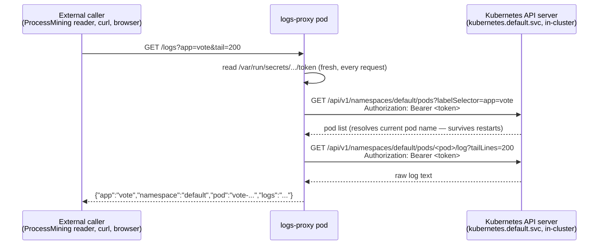

# Technical Architecture — Observability Demo on AKS

This document describes how this project is actually deployed and running
today: an AKS cluster in Azure, the services inside it, how they talk to
each other, and how the `logs-proxy` component turns `kubectl logs` into
plain HTTP URLs consumed by the separate ProcessMining reader-service.

It reflects the real, currently-running state — not the original design
docs (`README.md`, `camunda.md`, `camunda_setup.md`), which describe a local
Kind-cluster setup that turned out not to be possible on this machine (see
[§1](#1-why-aks-instead-of-local-kubernetes)).

---

## 1. Why AKS instead of local Kubernetes

The original design (`README.md`, `start-stack.ps1`) assumes Docker Desktop
+ Kind running locally. Neither is possible on this machine:

- Docker Desktop cannot be installed (blocked by policy).
- Every local alternative to Kind (Minikube, k3s, Rancher Desktop, WSL2 +
  anything) needs either Docker, Hyper-V, or WSL2 underneath — all three
  are unavailable and can't be installed either. `kind.exe` itself runs
  fine (it's just a binary, already bundled in this repo) — it has nothing
  to run the cluster node *in*.
- No arbitrary software downloads/installers are allowed on this machine at
  all — only `pip`/`npm` package installs (sandboxed, no admin, no system
  changes) are permitted.

**AKS (Azure Kubernetes Service)** is the only way to get a *real*
Kubernetes cluster under these constraints, because the cluster runs
entirely in Azure — nothing is installed locally. The trade-off: there is
no local `kubectl` either, so every cluster operation goes through
`az aks command invoke`, which runs the command *inside Azure* against the
cluster and streams the result back.

A separate, fully local (no Kubernetes, no Docker) dev stack also exists in
`local-dev/` + `run-local.ps1`, for cases where even AKS is out of scope —
see [§8](#8-the-other-local-stack-not-kubernetes). The two are independent;
this document is about the AKS side.

---

## 2. Azure resource inventory

| Resource | Name | Notes |
|---|---|---|
| Resource group | `rg-observability-demo` | region `eastus` |
| Container registry | `obsdemoacr01.azurecr.io` | **Standard** SKU, **anonymous pull enabled** |
| AKS cluster | `aks-observability-demo` | 2 nodes, `Standard_B2s_v2`, Kubernetes 1.35 |
| Azure Monitor workspace (managed Prometheus) | `DefaultAzureMonitorWorkspace-eastus` | auto-created in `defaultresourcegroup-eastus` when Prometheus metrics were enabled on the cluster |
| Prometheus query endpoint | `https://defaultazuremonitorworkspace-eastus-abcsbnaxa9ewczb5.eastus.prometheus.monitor.azure.com` | real PromQL endpoint, needs an Azure AD bearer token |

**Why anonymous pull instead of a normal ACR role assignment:** the AKS
cluster's managed identity would normally get `AcrPull` via
`az aks create --attach-acr` / `az aks update --attach-acr`. Both attempts
failed — *"Could not create a role assignment for ACR. Are you an Owner on
this subscription?"* — the account used for this deployment is not a
subscription Owner and can't grant IAM role assignments. Enabling anonymous
pull on the registry (Standard SKU required) sidesteps the need for any
role assignment or stored credential entirely; images are just publicly
pullable by URL.

**Container Apps was tried and abandoned.** An earlier pass explored
deploying `result`/`worker` (and later `logs-proxy`) as Azure Container
Apps instead of AKS pods. Once AKS was already up and paid for, running a
second, separate compute platform for one helper service was correctly
identified as redundant — the Container Apps environment was deleted, and
everything now lives in the one AKS cluster.

---

## 3. High-level architecture



---

## 4. End-to-end deployment cycle

Every step below ran with **no local Docker and no local kubectl** — image
builds happen server-side in ACR, and cluster operations run server-side
via `az aks command invoke`.



### Step-by-step

1. **Build each image in ACR** (no local Docker required):
   ```powershell
   az acr build --registry obsdemoacr01 --image vote:latest       ./vote
   az acr build --registry obsdemoacr01 --image result:latest     ./result
   az acr build --registry obsdemoacr01 --image worker:latest     ./worker
   az acr build --registry obsdemoacr01 --image camunda:latest    ./camunda
   az acr build --registry obsdemoacr01 --image logs-proxy:latest ./logs-proxy
   ```
   `az acr build` uploads the source folder and runs the `Dockerfile` build
   server-side inside ACR — this is how images get built without Docker
   ever running on this machine.

2. **Create the AKS cluster** with managed Prometheus enabled:
   ```powershell
   az aks create -g rg-observability-demo -n aks-observability-demo `
     --location eastus --node-count 2 --node-vm-size Standard_B2s_v2 `
     --enable-azure-monitor-metrics --generate-ssh-keys
   ```
   (`Standard_B2s` was tried first and rejected by subscription policy;
   `Standard_B2s_v2` is the allowed equivalent.)

3. **Resolve ACR access** — upgrade to Standard SKU and enable anonymous
   pull (see [§2](#2-azure-resource-inventory) for why this path was chosen
   over a role assignment):
   ```powershell
   az acr update --name obsdemoacr01 --sku Standard
   az acr update --name obsdemoacr01 --anonymous-pull-enabled true
   ```

4. **Deploy everything** via `az aks command invoke`, which uploads the
   manifest files and runs `kubectl apply` against the cluster in one call:
   ```powershell
   az aks command invoke -g rg-observability-demo -n aks-observability-demo `
     --command "kubectl apply -f db-deployment.yaml -f db-service.yaml -f vote-deployment.yaml -f vote-service.yaml -f result-deployment.yaml -f result-service.yaml -f worker-deployment.yaml -f camunda-deployment.yaml -f camunda-service.yaml -f redis-deployment.yaml -f redis-service.yaml -f logs-proxy-rbac.yaml -f logs-proxy-deployment.yaml -f logs-proxy-service.yaml" `
     --file k8s-specifications/app/db-deployment.yaml `
     --file k8s-specifications/services/db-service.yaml `
     ... (one --file per manifest)
   ```
   This is the **only** way `kubectl` runs in this setup — there is no
   local `kubectl` binary; the command executes inside Azure and streams
   `stdout`/`stderr` back.

5. **Verify** — `curl` the public LoadBalancer IPs, and use `logs-proxy`
   itself to pull real pod logs back for inspection.

6. **Fix-forward** — three real bugs were found and fixed this way during
   deployment (all below): rebuild the affected image, `kubectl rollout
   restart deployment <name>`, re-verify.

### Bugs found and fixed during this cycle

| Component | Symptom | Root cause | Fix |
|---|---|---|---|
| `vote` | Pod crash-looped on startup: `ValueError: invalid literal for int()` on `REDIS_PORT` | Kubernetes auto-injects `REDIS_PORT=tcp://<ip>:6379` into every pod in a namespace that has a Service called `redis` (legacy Docker-links-style env vars) — collided with the app's own `REDIS_PORT` env var | Renamed the app's own override to `VOTE_REDIS_PORT` |
| `worker` | Every vote crashed the process: `column "voter_id" of relation "votes" does not exist` | `CREATE TABLE IF NOT EXISTS votes (id VARCHAR ...)` in `Program.cs` didn't match the columns the `INSERT`/`UPDATE` statements actually used (`voter_id`, `created_at`) — a pre-existing bug in the original source | Fixed the `CREATE TABLE` to include `voter_id`/`created_at`; dropped the (empty) stale table so it recreated correctly |
| `logs-proxy` | `/logs` started returning `401 Unauthorized` on pod-list calls after ~2 hours of uptime | The in-cluster ServiceAccount token was read once at process startup and cached in a module-level variable; Kubernetes rotates that token file in place roughly hourly | Re-read the token fresh from `/var/run/secrets/kubernetes.io/serviceaccount/token` on every request instead of caching it |

---

## 5. Kubernetes resources deployed

All manifests live under `k8s-specifications/app/` (Deployments + RBAC) and
`k8s-specifications/services/` (Services), following the layout
`start-stack.ps1` already expected (that script targets a local Kind
cluster and doesn't apply here, but the manifest structure carried over).

| Deployment | Image | Service | Type | Public IP |
|---|---|---|---|---|
| `vote` | `obsdemoacr01.azurecr.io/vote:latest` | `vote` | LoadBalancer | `20.121.162.140` |
| `result` | `obsdemoacr01.azurecr.io/result:latest` | `result` | LoadBalancer | `20.121.76.175` |
| `worker` | `obsdemoacr01.azurecr.io/worker:latest` | *(none — consumer only)* | — | — |
| `redis` | `redis:7-alpine` | `redis` | ClusterIP | internal only |
| `db` | `postgres:15-alpine` | `db` | ClusterIP | internal only, **no PVC** (data lost on pod restart) |
| `camunda` | `obsdemoacr01.azurecr.io/camunda:latest` | `camunda` | ClusterIP | internal only |
| `logs-proxy` | `obsdemoacr01.azurecr.io/logs-proxy:latest` | `logs-proxy` | LoadBalancer | `104.45.175.71` |

Pods talk to each other by **Kubernetes DNS service name**, not IP — e.g.
`vote`'s `REDIS_HOST=redis` resolves to whatever pod is currently behind
the `redis` Service.

### `logs-proxy` RBAC (`logs-proxy-rbac.yaml`)

A dedicated, minimally-scoped identity — not the cluster-admin credentials
used for deployment:

```yaml
ServiceAccount: logs-proxy               (namespace: default)
Role: logs-proxy-role
  rules: [apiGroups: [""], resources: ["pods", "pods/log"], verbs: ["get", "list"]]
RoleBinding: logs-proxy-binding           (binds the two above)
```

---

## 6. Vote data flow (the application itself)



`vote` also exposes `POST /vote` (JSON) as a second entry point for
Camunda's external task worker (`Camundaflow.py`, run separately, outside
this cluster) — same Redis contract, tagged `source=camunda-orchestrated`
in the log line vs. `source=direct-ui` for the browser path.

---

## 7. `logs-proxy` — how the log URLs are generated

This is the piece that answers *"how is this generating"* for the URL
table below. `logs-proxy` exists for one reason: to turn `kubectl logs`
into a **plain HTTP URL** that an external system (the ProcessMining
reader-service) can poll with a simple `GET`, with no Kubernetes
credentials, kubeconfig, or CLI of its own.



**Why this is safe to expose as a bare URL with no auth header from the
caller's side:** `logs-proxy` runs *inside* the cluster and uses its own
pod's auto-mounted ServiceAccount token (scoped to `get`/`list` on
`pods`/`pods/log` only, via the RBAC in §5) to authenticate to the
Kubernetes API on the caller's behalf. The caller never sees or needs a
Kubernetes credential at all — the URL is the entire interface.

**Why `app=<name>` and not a specific pod name:** pod names change on every
restart/redeploy (e.g. `vote-86644fd4b6-54z8x` → `vote-86cdfd5bc-z2cgj`
after the `REDIS_PORT` fix rollout). `logs-proxy` resolves the *current*
pod behind that `app` label on every request, so the URL stays valid
indefinitely — you never need to know or update a pod name.

### Current log URLs (all point at `http://104.45.175.71`)

| Key | URL |
|---|---|
| camunda | `http://104.45.175.71/logs?app=camunda&tail=10` |
| vote | `http://104.45.175.71/logs?app=vote&tail=200` |
| worker | `http://104.45.175.71/logs?app=worker&tail=200` |
| result | `http://104.45.175.71/logs?app=result&tail=200` |
| redis | `http://104.45.175.71/logs?app=redis&tail=200` |
| db | `http://104.45.175.71/logs?app=db&tail=200` |

`tail` is optional (default 100, max 5000) — how many trailing log lines
to return. This is the same public IP for every app; only the `app` query
parameter changes.

**Known limitation:** each call returns the *current* tail, not a delta
since the last call — repeated polling will see overlapping content unless
the caller dedupes (the ProcessMining side does this by content hash; see
§8 of the integration notes below).

---

## 8. Integration with the ProcessMining project

The ProcessMining project (a separate codebase) needed a way to feed AKS
pod logs into its ingestion pipeline as a plain URL config value — not a
CLI command, not a file. `logs-proxy`'s `/logs` endpoint is that URL.

On the ProcessMining side, a reader class was built
(`app/readers/kubectl_logs_reader.py`) implementing their `BaseReader`
interface: polls each configured `app` from `logs-proxy`, splits into
lines, classifies severity by keyword (`ERROR`/`WARNING`/`Traceback`/
`CRITICAL` → level), dedupes by content hash, and yields `EventLogPayload`
records into their `event_log` table via the existing
`FluentdSeverityAnalyzer` (reused as-is — it already groups by
`server_id` and counts ERROR/WARN, a natural fit for per-app log lines).

This was verified end-to-end through their real `reader-service`
(`services/reader/main.py`, its actual poll/ack HTTP API) — not a mock:
a real poll returned real log lines from the live AKS pods, correctly
leveled and batched, and a second poll after `ack` returned zero
duplicates, confirming the dedupe-by-hash logic works correctly against
`logs-proxy`'s always-return-the-tail behavior.

That reader has since been generalized on the ProcessMining side into a
`generic_url_logs` source (`GenericUrlLogReader`), driven by a
UI-managed `log_source_config` table instead of a hardcoded app list in
`config/modules.yaml` — letting sources be added/removed from their
Configuration page without a code or config-file change. The URLs in the
table above are exactly what gets entered there.

---

## 9. `local-dev` — the other local stack (not Kubernetes)

Separately from all of the above, `local-dev/` + `run-local.ps1` provide a
**fully local, non-Kubernetes** way to run `vote`/`result` end-to-end on
this machine with zero Azure dependency, for cases where even AKS isn't
wanted:

- `redis_stub.py` — `fakeredis`'s `TcpFakeServer`, a real RESP-protocol
  server in memory (pip package, no installer).
- `pg_stub.mjs` — `@electric-sql/pglite` + `pglite-socket`: **actual
  Postgres** compiled to WebAssembly, exposed over the real Postgres wire
  protocol (npm packages, no installer, no native binary).
- `dev_worker.py` — a Python stand-in for `worker/Program.cs`, since the
  .NET SDK can't be installed on this machine either; same Redis/Postgres
  contract as the real worker.

This is entirely independent of AKS — no cluster, no `kubectl`, no Azure
resources at all. Run it with `.\run-local.ps1`, stop with
`.\stop-local.ps1`.

---

## 10. Known gaps / follow-ups

- **`logs-proxy /metrics`** (the "Prometheus (URL)" config value) returns
  `501` — it needs its own Azure AD identity granted `Monitoring Data
  Reader` on the Azure Monitor workspace, a subscription-level IAM grant
  this account can't self-approve (same Owner-permission wall as the ACR
  role assignment in §2).
- **Camunda** is deployed and running but its BPMN workflow path
  (`vote.bpmn` deployment, external task worker, `POST /result` on
  `result` — which doesn't currently exist as a route) hasn't been
  exercised end-to-end in AKS.
- **`db` has no persistent volume** — any pod restart wipes all vote data.
  Fine for a demo; would need a `PersistentVolumeClaim` for anything
  longer-lived.
- **`vote`, `result`, and `logs-proxy` are public with no authentication**
  — acceptable for a demo, but `vote`'s public IP is already visible to
  internet vulnerability scanners (harmless 404s observed for paths like
  `/security.txt`, `/hudson`).
