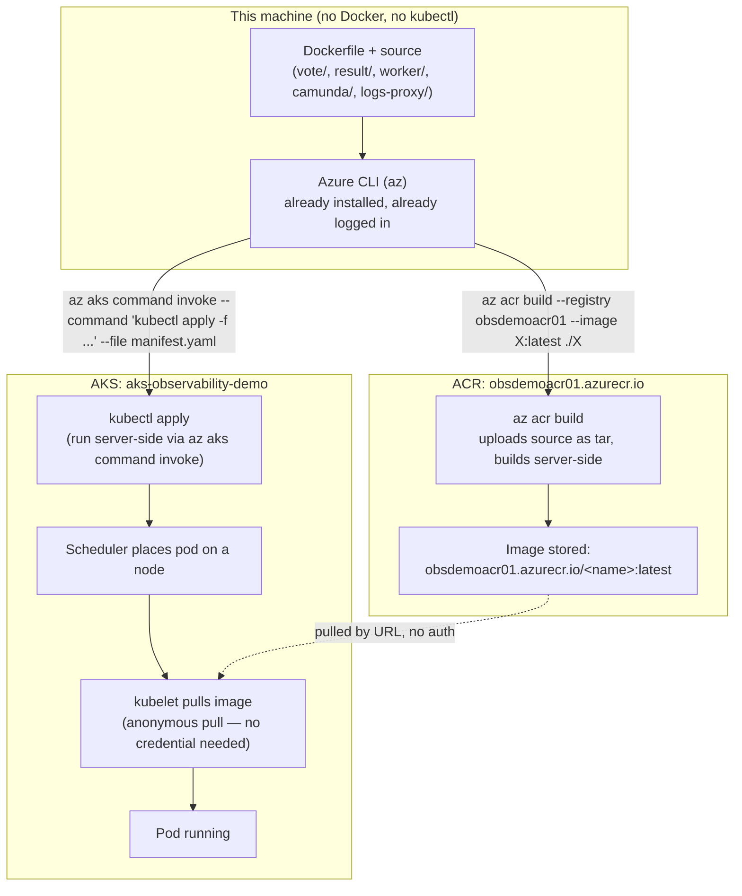
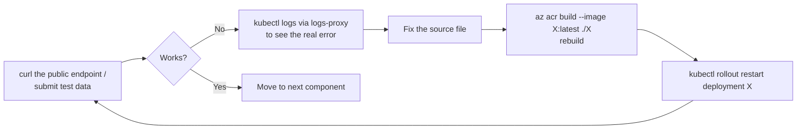

# Deployment Runbook — Docker → ACR → AKS, Step by Step

Pure technical walkthrough of how this project actually got from "empty
Azure subscription" to "running AKS cluster" on a machine with **no Docker,
no local kubectl, and no software installs allowed at all**. Every command
below is a real command that ran during this deployment, in the order it
ran, including the dead ends.

`README.md` covers what the project *is*. `ARCHITECTURE.md` covers what's
*currently running*. This document covers *how it got there* — the
Docker → ACR → AKS pipeline mechanics, one phase at a time.

---

## 0. The constraint that shapes everything

| Normally you'd... | Here, instead... |
|---|---|
| `docker build` locally | `az acr build` — uploads source, builds **inside ACR**, no Docker daemon involved anywhere on this machine |
| `docker push` to a registry | Same `az acr build` call does this automatically — build and push are one step |
| `kubectl apply -f ...` from a local shell | `az aks command invoke` — uploads the manifest files and runs `kubectl` **inside Azure**, streams the output back |
| `kind create cluster` for a quick local cluster | Not possible — Kind needs Docker to run the cluster node as a container, and Docker can't be installed here |

Confirmed dead ends before landing on this approach: Docker Desktop
(install blocked), Kind/Minikube/k3s (all need Docker, Hyper-V, or WSL2 —
none available), Azure Container Apps for the whole stack (works, but no
real Kubernetes primitives — no pods, no `kubectl logs`, no pod-level
Prometheus). AKS was the only path that gives real Kubernetes with zero
local installs, because the entire cluster runs in Azure.

---

## 1. The full pipeline, end to end



Nothing in this pipeline ever runs a container, a build, or `kubectl` on
the local machine — every box outside "This machine" executes remotely.

---

## 2. Phase-by-phase, with the actual commands

### Phase 1 — Confirm what already exists

Before creating anything, check the subscription for pre-existing state
(this project had already provisioned a resource group and ACR in an
earlier pass):

```powershell
az account show --query name -o tsv
az group show --name rg-observability-demo --query location -o tsv
az acr show --name obsdemoacr01 --query loginServer -o tsv
az aks list --resource-group rg-observability-demo --query "[].name" -o tsv
```

Result: `rg-observability-demo` (eastus) and `obsdemoacr01.azurecr.io`
already existed; no AKS cluster yet.

### Phase 2 — Register the resource providers managed Prometheus needs

`Microsoft.Monitor` (managed Prometheus) and `Microsoft.Dashboard`
(managed Grafana, not currently used but registered anyway) weren't
registered on this subscription yet — a one-time, free, account-level step:

```powershell
az provider register -n Microsoft.Monitor
az provider register -n Microsoft.Dashboard
az provider register -n Microsoft.OperationalInsights
```

Registration is asynchronous — this ran in the background while the next
phase started, and finished well before it was actually needed.

### Phase 3 — Build every image server-side in ACR

No local Docker, so every image is built by uploading the source folder to
ACR and letting it build there:

```powershell
az acr build --registry obsdemoacr01 --image vote:latest       ./vote
az acr build --registry obsdemoacr01 --image result:latest     ./result
az acr build --registry obsdemoacr01 --image worker:latest     ./worker
az acr build --registry obsdemoacr01 --image camunda:latest    ./camunda
az acr build --registry obsdemoacr01 --image logs-proxy:latest ./logs-proxy
```

Each of these:
1. Tars up the given folder (e.g. `./vote`) and uploads it to ACR.
2. ACR runs `docker build` against that source **on Azure's own build
   infrastructure** — this is the only "Docker build" happening anywhere
   in this entire deployment, and it's not on this machine.
3. Pushes the resulting image straight into the registry under
   `obsdemoacr01.azurecr.io/<name>:latest`.

`vote` and `camunda` needed real source/Dockerfiles reconstructed first —
see `ARCHITECTURE.md` and the session history for that (the original
`vote/` source and `camunda/processes/` were never committed to this repo).
`worker` and `logs-proxy` each got rebuilt **twice** more later in this
runbook, once a bug was found in each (Phase 7).

### Phase 4 — Create the AKS cluster

```powershell
az aks create `
  --resource-group rg-observability-demo `
  --name aks-observability-demo `
  --location eastus `
  --node-count 2 `
  --node-vm-size Standard_B2s `
  --enable-azure-monitor-metrics `
  --attach-acr obsdemoacr01 `
  --generate-ssh-keys
```

**This failed twice before succeeding:**

1. `Standard_B2s` → `ERROR: The VM size of Standard_B2s is not allowed in
   your subscription in location 'eastus'.` A subscription-level policy
   restricts which VM sizes can be provisioned. Fix: switch to the allowed
   equivalent, `Standard_B2s_v2`.
2. Retried with `Standard_B2s_v2` and `--attach-acr` together → the
   cluster itself was created successfully, but the trailing step (grant
   the cluster's managed identity an `AcrPull` role assignment on the
   registry) failed: `ERROR: Could not create a role assignment for ACR.
   Are you an Owner on this subscription?` — this account has Contributor
   rights, not Owner, and can't create IAM role assignments. Because that
   step failed, the overall command exited non-zero even though the
   cluster itself existed — confirmed separately with
   `az aks show --query provisioningState` → `"Succeeded"`.

**Final working sequence** — create without `--attach-acr`, resolve ACR
access as its own step (Phase 5):

```powershell
az aks create `
  --resource-group rg-observability-demo `
  --name aks-observability-demo `
  --location eastus `
  --node-count 2 `
  --node-vm-size Standard_B2s_v2 `
  --enable-azure-monitor-metrics `
  --generate-ssh-keys
```

Even this run's `--enable-azure-monitor-metrics` didn't actually take
effect (the prior failed attempt had aborted before reaching that step,
and this retry failed immediately with *cluster already exists* since
the cluster was already created). Confirmed and fixed in Phase 6.

### Phase 5 — Resolve ACR image-pull access

Three options exist for letting AKS pull private images; two require
subscription-level permissions this account doesn't have:

| Option | Requires | Result |
|---|---|---|
| `az aks update --attach-acr` (IAM role assignment) | Owner or User Access Administrator | ❌ failed — not Owner |
| Image pull secret (fetch ACR admin password → k8s Secret) | Nothing extra — but fetching/printing a registry password is a credential-exposure action | Blocked by this session's own safety classifier |
| **Anonymous pull** (registry-level setting, no credential, no IAM) | Standard SKU (registry was Basic) | ✅ works |

```powershell
az acr update --name obsdemoacr01 --sku Standard
az acr update --name obsdemoacr01 --anonymous-pull-enabled true
```

The first attempt at anonymous-pull (while still Basic SKU) failed with
`Anonymous pull is not supported for SKU Managed_Basic` — hence the SKU
upgrade first. Small ongoing cost increase (~$0.50/day more than Basic),
explicitly approved before running.

With this enabled, every pod in the cluster can pull
`obsdemoacr01.azurecr.io/*` images with **zero credentials, zero secrets,
zero IAM** — the registry is just publicly readable by URL.

### Phase 6 — Turn on managed Prometheus (separate step, after the fact)

Since `--enable-azure-monitor-metrics` never actually landed during
cluster creation (Phase 4), it was applied as its own update:

```powershell
az aks update --name aks-observability-demo --resource-group rg-observability-demo --enable-azure-monitor-metrics
```

Verified via:
```powershell
az aks show --name aks-observability-demo --resource-group rg-observability-demo --query "azureMonitorProfile.metrics"
# -> "enabled": true
```

This auto-provisions (if one doesn't already exist in the subscription) an
Azure Monitor Workspace and installs the `ama-metrics` scraping agent onto
the cluster — visible as "Write Extensions" entries in the AKS resource's
Activity Log in the Azure Portal.

### Phase 7 — Write and apply the Kubernetes manifests

`k8s-specifications/` was **completely empty** in this repo — every
manifest below was authored from scratch this session, following the
`app/` + `services/` layout `start-stack.ps1` already expected:

```
k8s-specifications/
├── app/
│   ├── redis-deployment.yaml
│   ├── db-deployment.yaml
│   ├── vote-deployment.yaml
│   ├── result-deployment.yaml
│   ├── worker-deployment.yaml
│   ├── camunda-deployment.yaml
│   ├── logs-proxy-deployment.yaml
│   └── logs-proxy-rbac.yaml        (ServiceAccount + Role + RoleBinding)
└── services/
    ├── redis-service.yaml           (ClusterIP)
    ├── db-service.yaml              (ClusterIP)
    ├── vote-service.yaml            (LoadBalancer)
    ├── result-service.yaml          (LoadBalancer)
    ├── camunda-service.yaml         (ClusterIP)
    └── logs-proxy-service.yaml      (LoadBalancer)
```

Deployed in two batches via `az aks command invoke` (which both uploads the
listed files and runs the given command against the cluster in one call):

```powershell
# Batch 1: redis, to prove the invoke + kubectl logs mechanism works first
az aks command invoke -g rg-observability-demo -n aks-observability-demo `
  --command "kubectl apply -f redis-deployment.yaml -f redis-service.yaml && kubectl get pods -o wide" `
  --file k8s-specifications/app/redis-deployment.yaml `
  --file k8s-specifications/services/redis-service.yaml

# Batch 2: everything else, once ACR access was resolved (Phase 5)
az aks command invoke -g rg-observability-demo -n aks-observability-demo `
  --command "kubectl apply -f db-deployment.yaml -f db-service.yaml -f vote-deployment.yaml -f vote-service.yaml -f result-deployment.yaml -f result-service.yaml -f worker-deployment.yaml -f camunda-deployment.yaml -f camunda-service.yaml && kubectl get pods -o wide" `
  --file k8s-specifications/app/db-deployment.yaml `
  --file k8s-specifications/services/db-service.yaml `
  --file k8s-specifications/app/vote-deployment.yaml `
  --file k8s-specifications/services/vote-service.yaml `
  --file k8s-specifications/app/result-deployment.yaml `
  --file k8s-specifications/services/result-service.yaml `
  --file k8s-specifications/app/worker-deployment.yaml `
  --file k8s-specifications/app/camunda-deployment.yaml `
  --file k8s-specifications/services/camunda-service.yaml
```

Both succeeded on the first try — every pod `1/1 Running` within seconds,
both `LoadBalancer` Services got public IPs assigned automatically by
Azure within about 10 seconds of creation.

### Phase 8 — `logs-proxy`: its own RBAC, then deploy

Built and deployed the same way as the app images (Phase 3 + this apply
step), but with its own dedicated ServiceAccount/Role/RoleBinding applied
first so it has *just enough* Kubernetes API permission to list pods and
read logs — nothing more:

```powershell
az acr build --registry obsdemoacr01 --image logs-proxy:latest ./logs-proxy

az aks command invoke -g rg-observability-demo -n aks-observability-demo `
  --command "kubectl apply -f logs-proxy-rbac.yaml -f logs-proxy-deployment.yaml -f logs-proxy-service.yaml" `
  --file k8s-specifications/app/logs-proxy-rbac.yaml `
  --file k8s-specifications/app/logs-proxy-deployment.yaml `
  --file k8s-specifications/services/logs-proxy-service.yaml
```

### Phase 9 — Verify, find real bugs, fix-forward

End-to-end verification surfaced three real bugs (not deployment
mechanics — actual application bugs, some pre-existing in the original
source). Each followed the same fix-forward cycle:



| # | Component | How it was caught | Fix |
|---|---|---|---|
| 1 | `vote` | `curl http://<vote-ip>/` → connection issue; `kubectl logs` (via `logs-proxy` itself, bootstrapping its own usefulness) showed `ValueError: invalid literal for int()` on `REDIS_PORT` | Renamed the app's env var to `VOTE_REDIS_PORT` — Kubernetes auto-injects `REDIS_PORT` for any pod sharing a namespace with a `redis` Service |
| 2 | `worker` | Submitted a vote, checked Postgres (`kubectl exec deploy/db -- psql -c 'SELECT vote, COUNT(id) FROM votes GROUP BY vote'`) → `0 rows`; `kubectl logs --previous` showed `column "voter_id" of relation "votes" does not exist` | `CREATE TABLE` in `Program.cs` didn't match the `INSERT`/`UPDATE` columns — fixed the schema, dropped the (empty) stale table, rebuilt, redeployed |
| 3 | `logs-proxy` | `/logs?app=vote` started returning `401 Unauthorized` roughly 2 hours after deploy | ServiceAccount token was cached once at startup; Kubernetes rotates it in place hourly | Read the token fresh from disk on every request instead of caching it |

Final verification, full loop:
```powershell
curl -X POST http://20.121.162.140/ -d "vote=a"   # vote's public IP
curl "http://104.45.175.71/logs?app=worker&tail=15"  # confirm worker processed it
curl http://20.121.76.175/                          # result's public IP, 200 OK
```

---

## 3. Why each Azure piece is doing what it's doing

- **ACR (`obsdemoacr01`)** exists purely because images need to live
  *somewhere* reachable by AKS, and `az acr build` is how they get built
  without Docker. Anonymous pull turns it from "needs credentials/IAM" into
  "just a URL", sidestepping the Owner-permission wall entirely.
- **AKS (`aks-observability-demo`)** is the only component that's genuinely
  necessary — it's the real Kubernetes cluster this whole exercise exists
  to get, since nothing local can provide one.
- **Azure Monitor Workspace** (managed Prometheus) is a side-effect of
  `--enable-azure-monitor-metrics` — it auto-creates itself the first time
  any cluster in the subscription enables managed Prometheus, hence it
  landing in a different (`defaultresourcegroup-eastus`) resource group
  than everything else.
- **`az aks command invoke`** is not a convenience choice — it is the
  *entire substitute* for local `kubectl` on this machine. Every
  `kubectl apply`, `kubectl logs`, `kubectl exec`, and `kubectl rollout
  restart` in this whole project ran through it.

---

## 4. Command cheat-sheet (reproducing this from scratch)

```powershell
# 1. Providers (one-time, per subscription)
az provider register -n Microsoft.Monitor
az provider register -n Microsoft.Dashboard

# 2. Build every image (repeat per service)
az acr build --registry obsdemoacr01 --image <name>:latest ./<folder>

# 3. Create the cluster
az aks create -g rg-observability-demo -n aks-observability-demo `
  --location eastus --node-count 2 --node-vm-size Standard_B2s_v2 `
  --enable-azure-monitor-metrics --generate-ssh-keys

# 4. Resolve ACR access
az acr update --name obsdemoacr01 --sku Standard
az acr update --name obsdemoacr01 --anonymous-pull-enabled true

# 5. Deploy (repeat --file per manifest, list every manifest in --command)
az aks command invoke -g rg-observability-demo -n aks-observability-demo `
  --command "kubectl apply -f a.yaml -f b.yaml" `
  --file path/to/a.yaml --file path/to/b.yaml

# 6. Any kubectl operation, ever
az aks command invoke -g rg-observability-demo -n aks-observability-demo `
  --command "kubectl <anything>"

# 7. Redeploy after a code fix
az acr build --registry obsdemoacr01 --image <name>:latest ./<folder>
az aks command invoke -g rg-observability-demo -n aks-observability-demo `
  --command "kubectl rollout restart deployment <name>"
```

See `ARCHITECTURE.md` for the resulting system's structure, data flow, and
the `logs-proxy` → ProcessMining integration built on top of this cluster.
